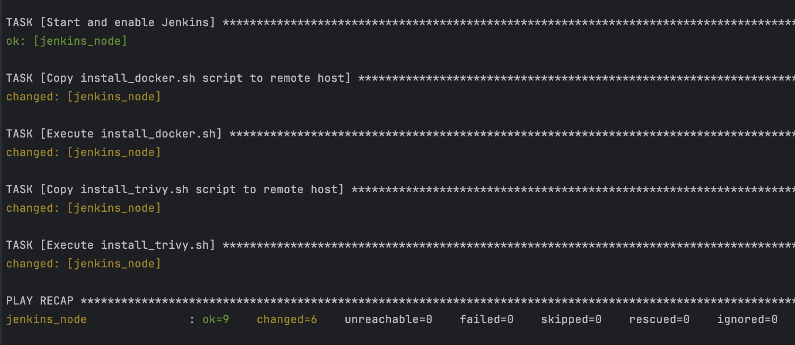
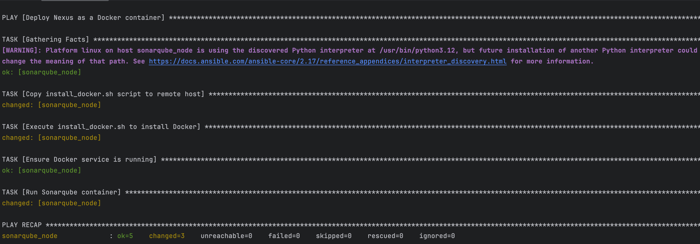

# todo-list-depi-206

## Documentations
### To Install jenkins on AWS using Ansible:
  - Edit inventory.yml
  - use "ansible-playbook -i inventory.yml jenkins_setup.yaml --private-key=/Users/diabf/Downloads/Jenkins-t.pem"
  

### To install sonarqube using Ansible:
-   ansible-playbook -i inventory.yml sonarqube_setup.yaml --private-key=/Users/diabf/Downloads/Jenkins-t.pem

### Jenkins Configuration
[Jenkins-Documentation](JENKINS-README.md)
