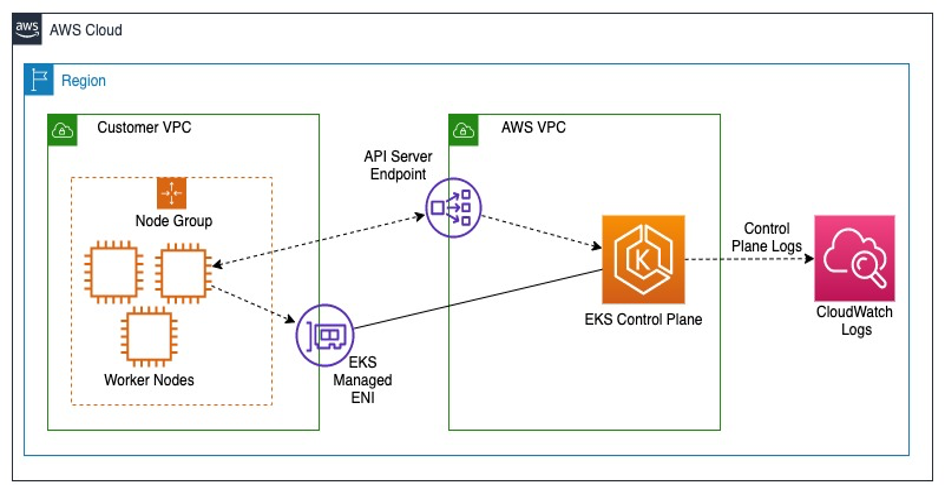

## The following diagram illustrates the Control plane logging architecture:



## AWS CloudWatch Container Insights Setup

The following guide will help you deploy Container Insights in your EKS cluster for better monitoring and logging.

### 1. **Install `cert-manager`**
First, install `cert-manager` if it is not already installed in the cluster. You can find more details in the [cert-manager Installation guide](https://cert-manager.io/docs/installation/).

To install `cert-manager` directly, run the following command:

```bash
kubectl apply -f https://github.com/jetstack/cert-manager/releases/latest/download/cert-manager.yaml
```

### 2. **Install Custom Resource Definitions (CRD)**
Next, install the CloudWatch agent custom resource definitions by running the following command:

```bash
curl https://raw.githubusercontent.com/aws-samples/amazon-cloudwatch-container-insights/main/k8s-quickstart/cwagent-custom-resource-definitions.yaml | kubectl apply --server-side -f -
```

### 3. **Deploy the Container Insights Operator**
Install the CloudWatch Container Insights operator by replacing the `cluster_name` and `region_name` with your specific values and running the following command:

```bash
ClusterName=DevOps-DEPI-206-eks-cluster
RegionName=eu-west-3

curl -s https://raw.githubusercontent.com/aws-samples/amazon-cloudwatch-container-insights/latest/k8s-deployment-manifest-templates/deployment-mode/daemonset/container-insights-monitoring/quickstart/cwagent-fluentd-quickstart.yaml | sed "s/{{cluster_name}}/$ClusterName/;s/{{region_name}}/$RegionName/" | kubectl apply -f -
```

### 4. **Create the CloudWatch Add-On for EKS**
Finally, create the CloudWatch Observability Add-On for the EKS cluster by running:

```bash
aws eks create-addon --cluster-name DevOps-DEPI-206-eks-cluster --addon-name amazon-cloudwatch-observability
```
