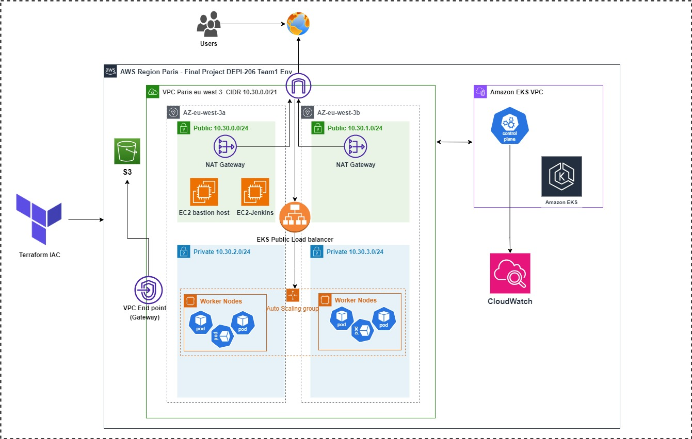

### Terraform Infrastructure Documentation

---
The following diagram illustrates the overall architecture of the infrastructure:



#### **1. Project Overview**
This Terraform project sets up a complete AWS environment, including:
- A **VPC** with public and private subnets.
- An **EKS cluster** to host applications with worker nodes.
- A **Jenkins EC2 instance** to facilitate CI/CD pipelines.
- A **Bastion host** for secure SSH access to the private network.

#### **2. Prerequisites**
Before applying this Terraform configuration, ensure the following:
- **AWS account** credentials (Access Key and Secret Key).
- Terraform installed on your local machine.
- SSH Key Pair created and available for EC2 access.
- Proper IAM permissions to provision resources (EC2, EKS, VPC, S3, etc.).

#### **3. Terraform Files**

##### **File 1: `eks-cluster.tf`**
- Provisions an EKS cluster with Kubernetes provider and managed worker node groups.
- Configures IAM roles for EKS and necessary permissions for cluster autoscaling and service access.
- Adds logging for better monitoring and troubleshooting.

##### **File 2: `vpc.tf`**
- Creates a VPC with a CIDR block of `10.30.0.0/21`, enabling DNS support and hostnames.
- Sets up public and private subnets in different availability zones (`eu-west-3a`, `eu-west-3b`).
- Configures route tables and a NAT gateway to allow traffic flow between private instances and the internet.
- Adds VPC endpoint for S3 to improve performance for data transfer to/from S3.

##### **File 3: `Jenkins_ec2.tf`**
- Provisions an EC2 instance for Jenkins with `t3a.medium` instance type.
- Assigns a security group allowing SSH (port 22), Jenkins (port 8080), and SonarQube (port 9000) access from anywhere.
- Attaches an elastic IP to make Jenkins publicly accessible.

##### **File 4: `main.tf`**
- Specifies the **AWS region** (`eu-west-3`), **access key**, and **secret key** for the project.
- Terraform will automatically load resources from other files, such as VPC and EKS configuration.

##### **File 5: `bastion-host.tf`**
- Provisions a **bastion host** using `t2.micro` instance type in the public subnet.
- Associates an elastic IP with the bastion host for SSH access.
- Attaches a security group allowing SSH from any IP.

#### **4. Deploying the Infrastructure**

Follow these steps to deploy the infrastructure:

**Step 1: Clone the Repository**
```bash
git clone <repository-url>
cd <repository-directory>
```

**Step 2: Initialize Terraform**
```bash
terraform init
```
This command initializes the working directory containing Terraform configuration files.

**Step 3: Apply the Configuration**
```bash
terraform apply
```
You will be prompted to confirm the changes. Type `yes` to proceed.

**Step 4: Access Jenkins**
- Once the Jenkins EC2 instance is running, you can access Jenkins at `http://<Elastic_IP>:8080`.

#### **5. Security Groups**

- **Jenkins EC2 Security Group:**
    - SSH: Port 22 open to all IP addresses.
    - Jenkins UI: Port 8080 open to all IP addresses.
    - SonarQube UI: Port 9000 open to all IP addresses.

- **Bastion Host Security Group:**
    - SSH: Port 22 open to all IP addresses.

#### **6. Outputs**

The following outputs will be generated after a successful deployment:
- **Jenkins Elastic IP**: The public IP address to access the Jenkins server.
- **Bastion Host Elastic IP**: The public IP address to access the bastion host for secure SSH access to the private network.

#### **7. Cleaning Up Resources**

To destroy all resources and clean up your environment, run:
```bash
terraform destroy
```
This will remove all AWS resources created by this configuration.

---
